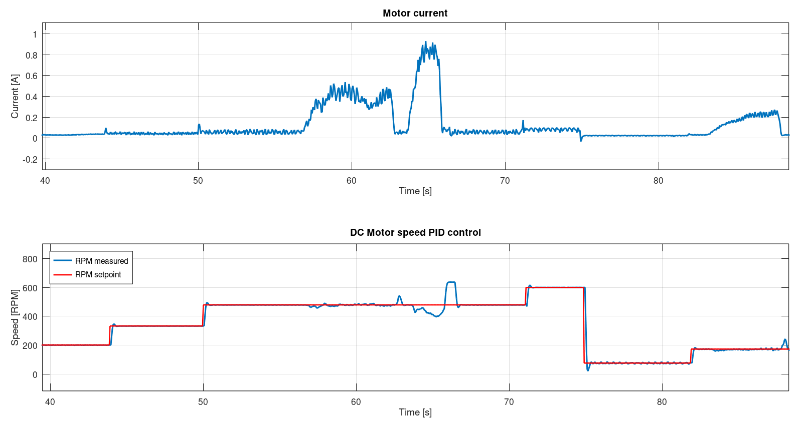
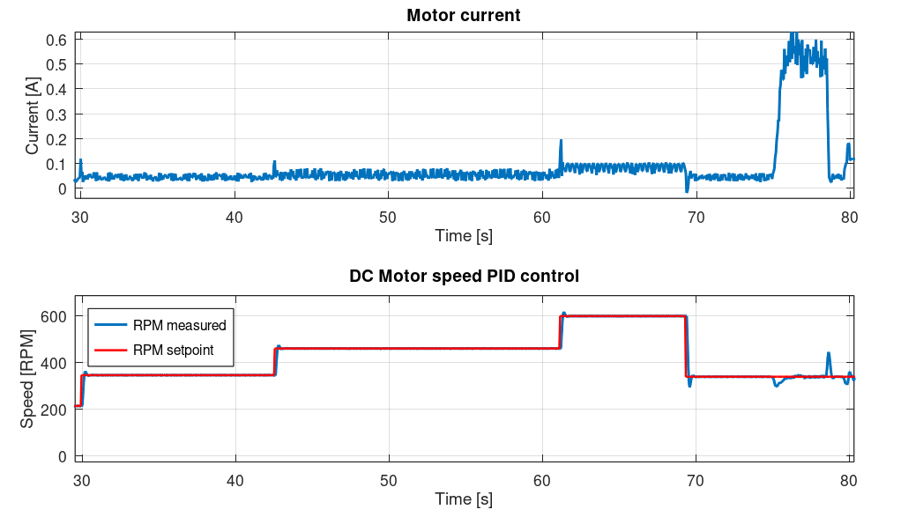

# INA228_STM32_driver
HAL based driver for INA228 current, voltage, power and temperature sensor;

The driver was implemented based on the official datasheet and designed for STM32 microcontrollers with HAL library.

# Features

- I2C communication
- STM32 HAL based
- Bus voltage measurement
- Shunt voltage measurement
- Current calculation
- Power calculation
- Die temperature measurement

# Hardware

   
  <em>INA228 sensor board </em>

The driver was tested on:

- STM32L476RG Nucleo devboard
- Adafruit's INA228 sensor board

Limitations:

The INA228 is not intended for AC current monitoring.

According to the datasheet, the device is designed for DC or slowly varying signals. Rapidly changing currents, such as those generated by a PWM-controlled DC motor, may produce unstable or averaged readings depending on ADC configuration and sampling time.

# Demo

Example 1: measurement of a Li-Ion cell during discharge under diffent load conditions. 
The plot shows measured current and bus voltage. The dynamic response of the cell under varying load is visible.

The driver was tested on:

- STM32L476RG Nucleo devboard
- Adafruit's INA228 sensor board

Sampling time: 50 ms

   
  <em>Figure 1. Li-Ion cell measurements</em>

Example 2: measurement of a DC motor power supply under diffent load conditions. 
The plot shows measured current and RPM speed.

   
  <em>Figure 2. DC motor current measurements along with PID control</em>

   
  <em>Figure 2. DC motor current measurements along with PID control</em>

The driver was tested on:

- STM32L476RG Nucleo devboard
- Adafruit's INA228 sensor board
