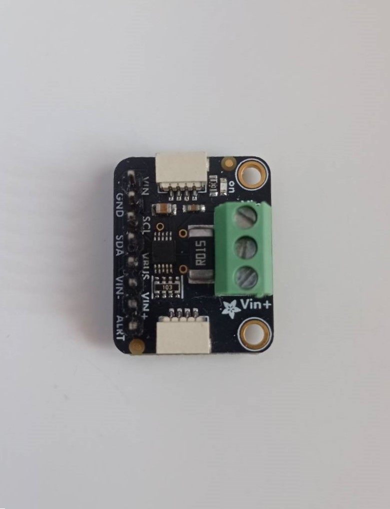
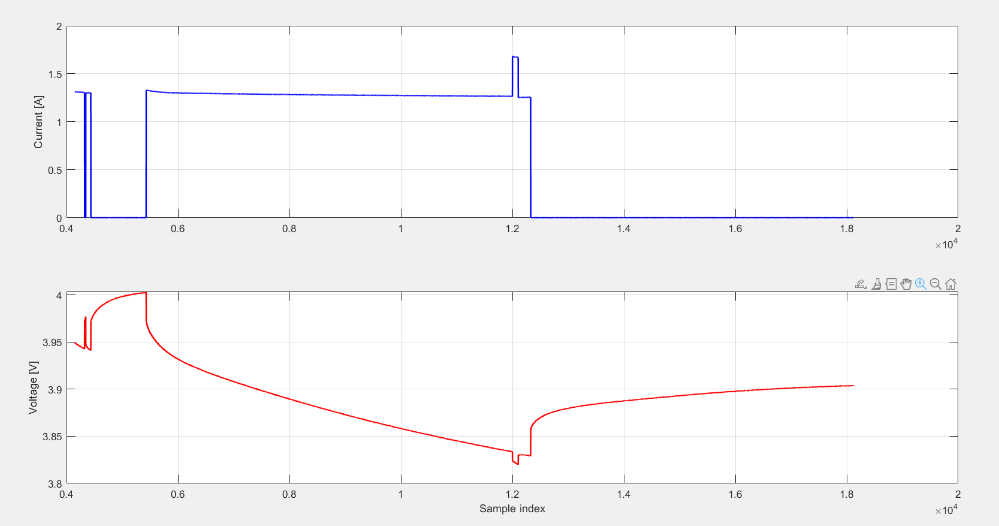

# INA228_STM32_driver
HAL based driver for INA228 current, voltage, power and temperature sensor;

The driver was implemented based on the official datasheet and designed for STM32 MCU with HAL library.

# Features

- I2C communication
- STM32 HAL based
- Bus voltage measurement
- Shunt voltage measurement
- Current calculation
- Power calculation
- Die temperature measurement

# Hardware

The driver was tested on:

- STM32L476RG Nucleo devboard
- Adafruit's INA228 sensor board

# Demo

Example measurement of a Li-Ion cell during discharge under diffent load conditions. 
The plot shows measured current and bus voltage. The dynamic response of the cell under varying load is visible.

Sampling time: 50 ms

